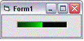



## KnightRider ActiveX Custom Control

### Description

This is a KnightRider Custom Control with customizable Back- and ForeColors, Size, Speed, and Effect. The appearance and effects can be viewed in the IDE; that is it is already active in Design Mode :- just set the Enabled-property to True. It was inspired by a previous submission to PSC.
 
### More Info
 

             |
---                |---
**Submitted On**   |2003-12-04 05:07:02
**By**             |[ULLI](https://github.com/Planet-Source-Code/PSCIndex/blob/master/ByAuthor/ulli.md)
**Level**          |Intermediate
**User Rating**    |4.9 (34 globes from 7 users)
**Compatibility**  |VB 6\.0
**Category**       |[Custom Controls/ Forms/  Menus](https://github.com/Planet-Source-Code/PSCIndex/blob/master/ByCategory/custom-controls-forms-menus__1-4.md)
**World**          |[Visual Basic](https://github.com/Planet-Source-Code/PSCIndex/blob/master/ByWorld/visual-basic.md)
**Archive File**   |[KnightRide1680101242003\.zip](https://github.com/Planet-Source-Code/ulli-knightrider-activex-custom-control__1-50306/archive/master.zip)

